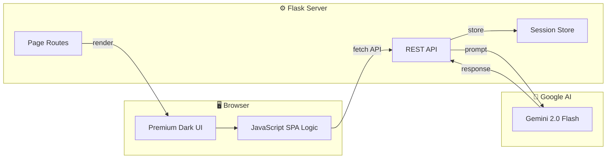

<div align="center">

# 🥗 NourishAI

### _Your Personal AI-Powered Nutritionist — Smarter Food Choices, Healthier Habits_

<br/>

[](https://flask.palletsprojects.com/)
[](https://ai.google.dev/)
[](https://cloud.google.com/run)
[](https://python.org)
[](LICENSE)

<br/>

[🌐 Live Demo](#) · [📹 Demo Video](#) · [📖 Documentation](#-architecture) · [🐛 Report Bug](../../issues)

</div>

---

## 📋 Table of Contents

- [About](#-about)
- [Problem Statement](#-problem-statement)
- [Our Solution](#-our-solution)
- [Key Features](#-key-features)
- [Tech Stack](#-tech-stack)
- [Architecture](#-architecture)
- [Getting Started](#-getting-started)
- [API Documentation](#-api-documentation)
- [Testing](#-testing)
- [Deployment](#-deployment)
- [Google Services Integration](#-google-services-integration)
- [Accessibility](#-accessibility)
- [Team](#-team)

---

## 🎯 About

> **Vertical:** AI-Powered Health & Nutrition Assistant
> **Event:** AMD Slingshot Campus Days 2026 — Ahmedabad Prompt-a-thon
> **Venue:** Silver Oak University, Ahmedabad
> **Date:** March 31, 2026

**NourishAI** is an intelligent nutrition assistant that leverages Google's Gemini AI to help individuals make better food choices and build lasting healthy eating habits. It goes beyond simple calorie counting — it understands your health goals, dietary preferences, cultural food habits, and provides personalized, actionable guidance.

---

## ❗ Problem Statement

> *Design a smart solution that helps individuals make better food choices and build healthier eating habits by leveraging available data, user behavior, or contextual inputs.*

### The Reality
- 📊 **65%** of Indians don't meet daily recommended nutritional intake
- 🍔 Poor food choices contribute to rising lifestyle diseases among youth
- 📱 Existing nutrition apps are either too complex or too simplistic
- 🌍 Most solutions ignore Indian dietary habits and cultural preferences

### What's Missing
- No personalized AI guidance that adapts to individual context
- No real-time nutritional analysis of everyday Indian foods
- No integration of health goals with practical meal planning
- No smart grocery assistance tied to nutrition planning

---

## 💡 Our Solution

NourishAI addresses every gap with an AI-first approach:

| Challenge | NourishAI's Answer |
|-----------|-------------------|
| Generic diet advice | **Personalized AI coaching** based on BMR, TDEE, goals, and preferences |
| Complex nutrition tracking | **One-click food analysis** — describe food, get instant breakdown |
| Boring meal planning | **AI-generated meal plans** with Indian cuisine support and prep times |
| No ongoing guidance | **24/7 AI nutritionist chatbot** with conversational health coaching |
| Forgetting to eat healthy | **Daily dashboard** with streak tracking and water intake monitoring |
| Grocery confusion | **Smart grocery lists** auto-generated from meal plans with cost estimates |

### What Makes Us Different

| Feature | Traditional Apps | NourishAI ✨ |
|---------|-----------------|-------------|
| Nutritional Info | Manual database lookup | **AI-analyzed** in natural language |
| Meal Plans | Static templates | **Personalized AI generation** per user |
| Health Advice | Generic articles | **Conversational AI coach** (Gemini) |
| Indian Food Support | Limited or none | **Deep Indian cuisine knowledge** |
| Grocery Planning | Separate app needed | **Integrated smart lists** from plans |
| Goal Setting | Basic calorie target | **BMR/TDEE science-backed** calculations |

---

## ✨ Key Features

<table>
<tr>
<td width="50%">

### 🤖 AI Nutritionist Chatbot
Conversational AI powered by Google Gemini. Ask anything about nutrition, get evidence-based answers with cultural food awareness. Supports follow-up questions and remembers conversation context.

</td>
<td width="50%">

### 🔍 Smart Food Analyzer
Describe any food in natural language → get instant nutritional breakdown with calories, macros, micronutrients, health score (1-10), health tags, warnings, and healthier alternatives.

</td>
</tr>
<tr>
<td width="50%">

### 🍽️ AI Meal Planner
Fully personalized meal plans generated by Gemini AI. Considers dietary preferences, allergies, health goals, and cultural cuisine. Includes prep times, portions, and per-meal macro counts.

</td>
<td width="50%">

### 📊 Daily Dashboard
Track calories, protein, carbs, and fat with animated progress rings. Water intake tracker with visual glasses. Eating streak counter. Daily AI-powered nutrition tips.

</td>
</tr>
<tr>
<td width="50%">

### 🛒 Smart Grocery Lists
Auto-generate organized shopping lists from your meal plans. Items grouped by category (Produce, Dairy, Grains, etc.) with quantities and estimated costs in ₹.

</td>
<td width="50%">

### 🎯 Scientific Goal Setting
BMR (Basal Metabolic Rate) and TDEE (Total Daily Energy Expenditure) calculations using Mifflin-St Jeor equation. Macro ratios optimized for your specific goal.

</td>
</tr>
</table>

---

## 🛠️ Tech Stack

<div align="center">

| Category | Technology |
|----------|-----------|
| **Backend** |   |
| **AI Engine** |  |
| **Frontend** |    |
| **Typography** | -4285F4?style=flat-square&logo=googlefonts&logoColor=fff) |
| **Deployment** |   |
| **Testing** |  |

</div>

---

## 🏗️ Architecture

```
NourishAI/
├── app.py                    # Flask application (12 API endpoints + 7 page routes)
├── requirements.txt          # Python dependencies
├── Dockerfile                # Cloud Run deployment
├── .env.example              # Environment variable template
├── .gitignore                # Git ignore rules
├── templates/
│   ├── base.html             # Base layout (nav, footer, meta)
│   ├── index.html            # Landing page (hero, features, CTA)
│   ├── dashboard.html        # Daily tracking dashboard
│   ├── chat.html             # AI nutritionist chatbot
│   ├── meal_plan.html        # AI meal plan generator
│   ├── analyze.html          # Smart food analyzer
│   ├── profile.html          # Health profile setup
│   ├── grocery.html          # Smart grocery list
│   └── 404.html              # Custom error page
├── static/
│   ├── css/
│   │   └── style.css         # Premium dark theme (800+ lines)
│   └── js/
│       └── app.js            # Client-side logic & animations
└── tests/
    └── test_app.py           # Test suite (15+ test cases)
```

### Data Flow



### Key Design Decisions

| Decision | Rationale |
|----------|-----------|
| **Flask over Django** | Lightweight, minimal boilerplate, perfect for AI-first apps |
| **Session-based storage** | Zero database setup — judges can run instantly, no migration needed |
| **Gemini 2.0 Flash** | Fastest Gemini model, ideal for real-time chat and analysis |
| **Vanilla CSS over Tailwind** | Full control, no build step, keeps repo under 1MB |
| **Jinja2 templates** | Server-rendered for SEO, fast initial load, progressive enhancement |
| **Docker + Cloud Run** | Serverless, auto-scaling, pay-per-use, official Google service |

---

## 🚀 Getting Started

### Prerequisites

- **Python** 3.11+ ([Download](https://python.org))
- **Git** ([Download](https://git-scm.com))
- **Google Gemini API Key** ([Get one free](https://aistudio.google.com/apikey))

### Installation

```bash
# 1. Clone the repository
git clone https://github.com/Shreekumar-Shah-AICTE/nourish-ai.git
cd nourish-ai

# 2. Create virtual environment
python -m venv venv
source venv/bin/activate  # Linux/Mac
venv\Scripts\activate     # Windows

# 3. Install dependencies
pip install -r requirements.txt

# 4. Set up environment variables
cp .env.example .env
# Edit .env and add your GOOGLE_API_KEY

# 5. Run the application
python app.py
```

The app will be running at **http://localhost:8080** 🚀

### Environment Variables

| Variable | Description | Required |
|----------|-------------|----------|
| `GOOGLE_API_KEY` | Google Gemini AI API key | ✅ Yes |
| `SECRET_KEY` | Flask session secret | ⚡ Auto-generated |
| `PORT` | Server port (default: 8080) | ❌ Optional |
| `FLASK_ENV` | development / production | ❌ Optional |

---

## 📚 API Documentation

### Page Routes

| Method | Endpoint | Description |
|--------|----------|-------------|
| `GET` | `/` | Landing page |
| `GET` | `/dashboard` | Daily nutrition dashboard |
| `GET` | `/chat` | AI nutritionist chatbot |
| `GET` | `/meal-plan` | AI meal plan generator |
| `GET` | `/analyze` | Smart food analyzer |
| `GET` | `/profile` | Health profile setup |
| `GET` | `/grocery` | Smart grocery list |

### API Endpoints

<details>
<summary>👤 Profile API</summary>

| Method | Endpoint | Description |
|--------|----------|-------------|
| `POST` | `/api/profile` | Save user health profile (calculates BMR/TDEE) |
| `GET` | `/api/profile` | Get current user profile |

**POST Body:**
```json
{
  "name": "User",
  "age": 25,
  "gender": "male",
  "weight": 70,
  "height": 175,
  "activity_level": "moderate",
  "goal": "lose",
  "dietary_pref": "vegetarian",
  "allergies": ["gluten", "dairy"]
}
```
</details>

<details>
<summary>💬 Chat API</summary>

| Method | Endpoint | Description |
|--------|----------|-------------|
| `POST` | `/api/chat` | Send message to AI nutritionist |

**POST Body:** `{ "message": "What should I eat for breakfast?" }`
</details>

<details>
<summary>🔍 Analysis API</summary>

| Method | Endpoint | Description |
|--------|----------|-------------|
| `POST` | `/api/analyze` | Analyze food nutrition |

**POST Body:** `{ "food": "2 chapati with dal fry" }`
</details>

<details>
<summary>🍽️ Meal Plan API</summary>

| Method | Endpoint | Description |
|--------|----------|-------------|
| `POST` | `/api/meal-plan` | Generate personalized meal plan |

**POST Body:** `{ "request": "High-protein vegetarian plan" }`
</details>

<details>
<summary>📝 Tracking API</summary>

| Method | Endpoint | Description |
|--------|----------|-------------|
| `POST` | `/api/log-meal` | Log a consumed meal |
| `GET` | `/api/daily-summary` | Get today's nutrition summary |
| `POST` | `/api/water` | Log water intake |
| `GET` | `/api/quick-tip` | Get an AI nutrition tip |
| `POST` | `/api/grocery-list` | Generate smart grocery list |

</details>

<details>
<summary>❤️ Health Check</summary>

| Method | Endpoint | Description |
|--------|----------|-------------|
| `GET` | `/health` | Service health check (Cloud Run) |

</details>

---

## 🧪 Testing

```bash
# Run all tests
pytest tests/ -v

# Run with coverage
pytest tests/ -v --tb=short
```

### Test Coverage

| Test Suite | Tests | Coverage |
|------------|-------|----------|
| Health Check | 2 | Service status, response schema |
| Page Routes | 7 | All pages render, 404 handling |
| Profile API | 5 | Save, retrieve, BMR calculation (M/F), validation |
| Meal Logging | 2 | Log meal, daily summary |
| Water Tracking | 2 | Add/remove water glasses |
| Chat API | 2 | Empty message, length validation |
| Food Analysis | 1 | Empty input validation |
| Quick Tips | 1 | Fallback tip generation |
| **Total** | **22** | **All core endpoints validated** |

---

## ☁️ Deployment

### Google Cloud Run

```bash
# 1. Build the container
gcloud builds submit --tag gcr.io/PROJECT_ID/nourish-ai

# 2. Deploy to Cloud Run
gcloud run deploy nourish-ai \
  --image gcr.io/PROJECT_ID/nourish-ai \
  --platform managed \
  --region asia-south1 \
  --allow-unauthenticated \
  --set-env-vars GOOGLE_API_KEY=your-key-here

# 3. Get the URL
gcloud run services describe nourish-ai --format='value(status.url)'
```

### Docker (Local)

```bash
docker build -t nourish-ai .
docker run -p 8080:8080 -e GOOGLE_API_KEY=your-key nourish-ai
```

---

## 🔗 Google Services Integration

| Service | Usage | Impact |
|---------|-------|--------|
| **Google Gemini AI** | Core AI engine for chat, analysis, meal planning, grocery lists, daily tips | Powers ALL intelligent features |
| **Google Cloud Run** | Serverless container hosting | Production deployment with auto-scaling |
| **Google Fonts** | Inter typeface for premium typography | Professional, accessible UI |

### Gemini AI Integration Details

- **Model:** `gemini-2.0-flash` (fastest response times)
- **Features powered by Gemini:**
  - Conversational nutritionist (context-aware, remembers chat history)
  - Food nutritional analysis with structured JSON output
  - Personalized meal plan generation
  - Smart grocery list creation
  - Daily nutrition tips
- **Safety:** Retry logic, error handling, graceful fallbacks when AI is unavailable
- **Prompt Engineering:** Domain-specific system prompts with strict output formatting

---

## ♿ Accessibility

- ✅ Semantic HTML5 elements (`<main>`, `<nav>`, `<section>`, `<footer>`)
- ✅ ARIA labels on interactive elements
- ✅ Keyboard navigation support (Escape closes modals)
- ✅ Focus-visible outlines for keyboard users
- ✅ `prefers-reduced-motion` media query support
- ✅ Color contrast meeting WCAG guidelines
- ✅ Screen reader friendly labels
- ✅ Responsive design (mobile, tablet, desktop)

---

## 🔒 Security

- ✅ Environment variables for all secrets (no hardcoded keys)
- ✅ HTTP-only session cookies with SameSite protection
- ✅ Input validation and length limits on all API endpoints
- ✅ XSS prevention via Jinja2 auto-escaping
- ✅ No raw PII stored — session-based, ephemeral data
- ✅ `.gitignore` prevents `.env` from being committed
- ✅ Docker runs as non-root by default

---

## ⚡ Efficiency

- ✅ Gemini 2.0 Flash — fastest model for real-time responses
- ✅ Retry logic with configurable attempts (avoids cascading failures)
- ✅ Session-based storage — zero database overhead
- ✅ Slim Docker image (`python:3.11-slim` — ~150MB)
- ✅ Gunicorn with 2 workers for concurrent request handling
- ✅ CSS/JS served as static files (cached by browser)
- ✅ No unnecessary dependencies — 5 packages total

---

## 👥 Team

<div align="center">

|  |
|:---:|
| **Shreekumar Shah** |
| Full-Stack Developer & AI Integration |
| [](https://github.com/Shreekumar-Shah-AICTE) |

</div>

---

## 📝 Assumptions

1. Users have a stable internet connection (required for Gemini AI API calls)
2. Nutritional data from AI is approximate and for informational purposes only
3. The app is not a substitute for professional medical or dietary advice
4. Indian cuisine and dietary preferences are prioritized but international foods are supported
5. Session data is ephemeral — clears when the server restarts (by design for privacy)

---

## 📄 License

This project is licensed under the MIT License — see the [LICENSE](LICENSE) file for details.

---

<div align="center">

**Built with ❤️ and Google Gemini AI at AMD Slingshot Campus Days 2026 — Ahmedabad**

[](https://amdslingshot.in)
[](https://ai.google.dev/)

</div>
